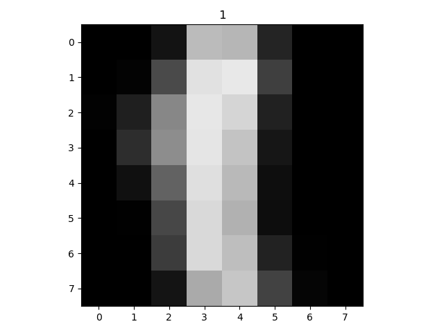
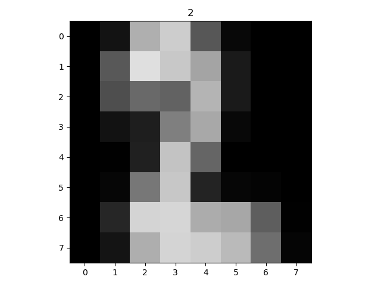
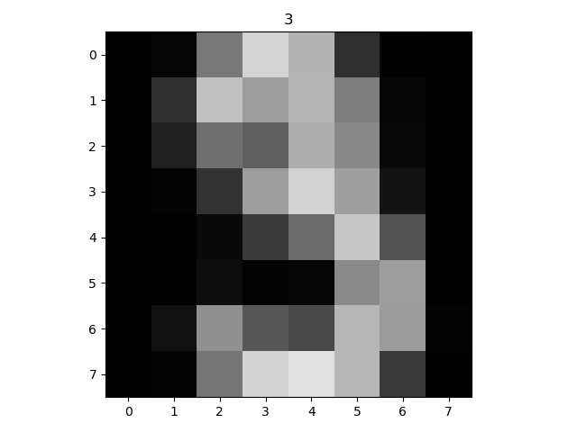
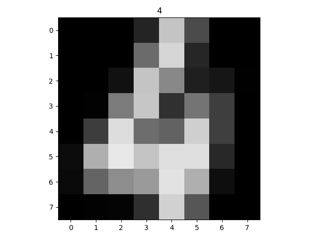
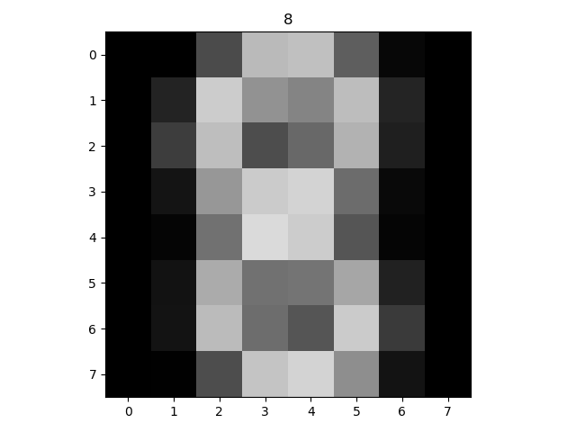
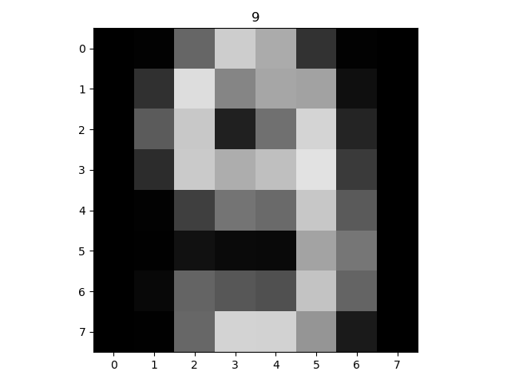

# kmeans-classifier
K-Means Clustering Classifier for the Optdigits dataset
It can receive as in input the number of k clusters. From the calculated centroids, it plots the predicted optdigits digit for each centroid.\
This repo also includes the images of the optdigits centroids calcualted from this classifier.\
With k = 10 the accuracy reached 72%. With k = 30 the accuracy reached 80%
## How to Run
python kmeans.py [-h]

